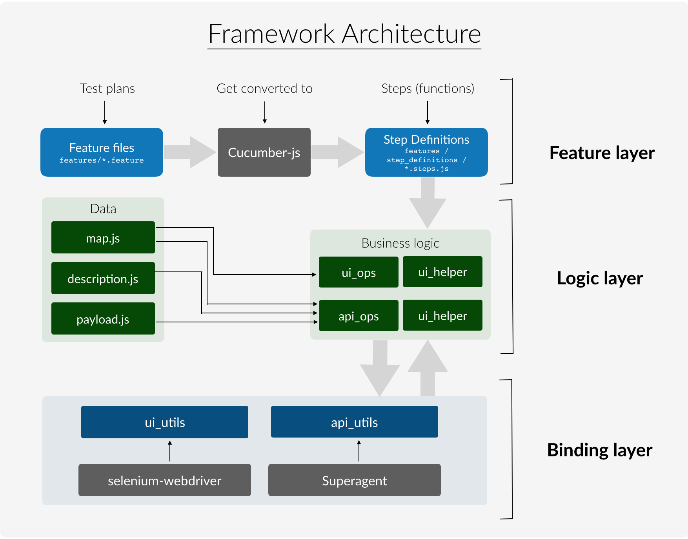

# MangoJS
A complete test automation framework suite, built using Gerhkin BDD framework and Selenium as the utility library. 

## Contents
1. [Framework (What was used)](#Framework)
2. [How to run the suite](#How-to-run-the-suite)
    1. [Method A](#Method-A)
    2. [Method B](#Method-B)
    3. [Run the automation suite](#Run-the-Automation-Suite)
       1. [Running through Docker](#Running-through-Docker)
       2. [Running through npm](#Running-through-npm)
3. [Added bonus - API Automation](#API-Automation)
4. [Framework Architecture](#Framework-Architecture)
5. [Why this framework?](#Why-this-framework?)
6. [Contact](#Contact)

## **Framework**
It a Javascript-based test automation framework suite that I developed in 2019. It is a Behavioral Driven Development (BDD) framework comprising of the following packages:
- **Cucumber-js** (for writing test plans in BDD format)
- **Superagent** (to automate API)
- **selenium-webdriver** (to automate UI)

## **How to run the suite**
### **Pre-requisites**
- #### **Method A**
    If you simply want to run the suite without knowing about the mechanics of it, having `docker` installed would be sufficient

- #### **Method B**  
    An alternate way of running the script is through npm. For this, you would need to install the following:
    1. `node.js`
    2. `npm` or `yarn` 

### **Run the Automation Suite**
First you need to clone the repo to your local
- Clone with SSH:     
    `git clone git@gitlab.com:rahul.beck/sennderqa.git`

    OR

- Clone with HTTPS:     
    `git clone https://gitlab.com/rahul.beck/sennderqa.git`

Then you need to follow either of the below two methods
#### **Method A**: Running through Docker
Open the command line and point it to the directory of the repo on your system. The run:
    
    docker-compose up --build
That's it.

Docker will pull all the images, install all the packages, set all the environment variables and run the script

#### **Method B**: Running through npm
To execute the script yourself, first open the command line and point it to the directory of the repo on your system. Then run the below steps

1. **Install all dependencies**
    
    Run `npm install` or `yarn` (depending upon what you have installed)
    
    This will import all dependencies including the chromedriver
2. **Set environment variables**
    
    Open the folder and create a file called `.env` and copy all contents from the `.env.example` file present in the folder. Since `.env` files are not supposed to be committed to git, you need to create the file.

    The *.example* file is practically just a template of how the *.env* file would look. It is not supposed to contain any values but for the sake of simplicity for explanation, I have added a couple of values to it so you just need to copy paste it to the `.env` file
3. **Run the script**

    > Note: when running, the cases are executed in alphabetical order. So API cases would run first. That's why, for the first 10-15 seconds, you won't see UI running because that's when the API cases are being executed
    
    Once everything is set, run the following command in the command line:

    `npm run demo`

    This will start the execution of all the test cases

## **API Automation**

If you want to run only API cases, simply run the command:
    
    npm run api

If you want to run only UI cases, run the command:

    npm run ui

## **Framework Architecture**
<<<<<<< HEAD

=======

>>>>>>> 74bad31 (Modify ops code)

## **Why this framework?**
- ### **Bridging the gap between Product Owner and QA**
    With the test plan is written plain english in BDD format, it acts as a layer between the acceptance criteria and the automation code. The test plans are easy to understand and written almost in the way the Product Owner writes writes the user stories. 

- ### **Bridging the gap between Manual QA and automation code**
    When a user story comes to test, the first step is that we create test plans then test the functionality and then move to automation once it is stable enough to automate. Usually, QA ends up creating two test plans, one for manual QA execution and other for automation. 

    Using cucumber-js, the framework provides a way to attach your code directly to the manual test plan and thus avoiding creating another plan for automation 

- ### **Reducing Selenium's complexity**
    UI automation's primary requirement is identifying the web element. Based on the selector you use (Xpath, css, class, id etc.), there is a separate command for each type of selector. By using MangoJS, you don't need to keep track of the selector you use. 
    
    The `get_element` command, for example, takes the selector as the first parameter. It identifies whether the selector is a XPath or a css selector and fetches the element. Under-the-hood, MangoJS uses Selenium to fetch the element. It just makes it easier for the QA engineer to focus on the business logic and not worry about which syntax to use

- ### **Integrated API automation**
    The framework seggregates web-service data from the code and provides a convinient way to link them both. The framework architecture avoids and encourages non-hardcoded services as it parameterizes as much as possible.

- ### **Dockerized**
    For running regression cases as fast as possible, and to achieve the target of spontaneous releases, moving the script to docker container helps achieve all of it

- ### **Choosing this over cypress**
    I have worked with `cypress` in the past. It is great if the motive is to automate only end-to-end cases (in testing terminology, this is also referred to as the happy-path testing).
    
    But, if you want to automate a wide set of integration cases, using cypress turns out to be a bit complex and less coder-friendly. For instance, cypress doesn't support conditional `if-else` statements. 

    For complex functionalities, we ofetn move beyond the end-to-end cases and have to create a larger automation plan to cover integration cases as well

